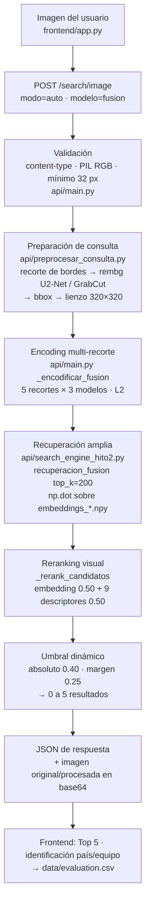

# MOTOR — Motor de búsqueda visual de camisetas (RAG-V2)

Este documento describe el motor de búsqueda visual del proyecto: qué es, cómo
funciona, con qué datos trabaja, qué tan rápido es, hasta dónde escala y qué
precisión real tiene. El motor recibe una imagen de consulta (una camiseta,
un mockup o una foto de persona), la convierte en vectores con modelos de
visión tipo CLIP y devuelve los **5 productos visualmente más parecidos** del
catálogo, con ID, nombre, imagen, URL, proveedor y score de similitud. La
interfaz Streamlit solo consume la API; no calcula embeddings ni busca localmente.

Todo lo que sigue está verificado contra el código y los artefactos del
repositorio. Las cifras medidas en esta sesión están marcadas como **Medido
(esta sesión)**, las que vienen de ejecuciones previas llevan su archivo de
origen, y las proyecciones están marcadas como **Estimado**.

---

## 1. Qué hace el motor (respuesta corta)

| Pregunta | Respuesta |
|---|---|
| ¿Qué busca? | Similitud visual por imagen contra un catálogo de **15.272 productos** |
| ¿Con qué modelos? | CLIP (`openai/clip-vit-base-patch32`), OpenCLIP (`laion/CLIP-ViT-B-32-laion2B-s34B-b79K`) y SigLIP (`google/siglip-base-patch16-224`) |
| ¿Cómo se compara? | Producto punto con vectores L2-normalizados = **similitud coseno**, búsqueda por **fuerza bruta (barrido lineal O(N))**, sin ANN |
| ¿Qué devuelve? | Top 5 (o menos) con `id, nombre, imagen, url, proveedor, score` + scores de reranking |
| ¿Dónde corre? | API FastAPI (`api/main.py`) + interfaz Streamlit (`frontend/app.py`), **CPU sola** (torch 2.14.0+cu… build `+cpu`, sin CUDA) |
| ¿Ruta por defecto de la UI? | `modo=auto` + `modelo=fusion` (hardcodeado en `frontend/app.py:622`) = preprocesamiento + 3 modelos × 5 recortes + 200 candidatos + reranking |

**Ruta rápida de verificación:**

1. Levantar la API: `python -m uvicorn api.main:app --port 8000`.
2. Consultar `GET /health` → `products` y `embeddings` deben coincidir (15.272).
3. Probar: `curl -X POST -F "file=@data/images_normalized/AIM-P001-001.jpg" http://localhost:8000/search/image/v2`.
4. Interfaz: `streamlit run frontend/app.py`.

---

## 2. Cómo funciona (pipeline paso a paso)

### 2.1 Recepción y validación (`api/main.py`)

- `POST /search/image` (`search_image`, línea 320) y `POST /search/image/v2`
  (`search_image_v2`, línea 487) aceptan `file` (multipart) y los campos de
  formulario `modo` y `modelo`.
- Validaciones: `content-type` debe ser `image/jpeg`, `image/jpg` o `image/png`;
  la imagen se abre con PIL y se convierte a RGB; **mínimo 32 px por lado**
  (`MIN_DIM = 32`, línea 252); `modelo` debe estar en
  `("clip", "openclip", "fusion")`.
- Errores: 400 para imagen inválida/demasiado pequeña/modelo desconocido;
  500 con mensaje (no el servidor) si falta un archivo de datos o falla el
  modelo.

### 2.2 Preparación de la consulta (`api/preprocesar_consulta.py`)

Función `preparar_consulta(datos, tamano=320)`:

1. `_recortar_bordes` — elimina bandas casi uniformes del borde.
2. Segmentación: **rembg (U2-Net)** si está instalado; si no, **GrabCut de
   OpenCV** (3 iteraciones). *En este entorno `rembg` no está instalado
   (verificado con `pip list`), así que se usa GrabCut.*
3. `_bbox` sobre la máscara → recorte a la región de interés.
4. `_centrar_y_redimensionar` — lienzo cuadrado blanco y resize LANCZOS a
   **320×320**.
5. Devuelve `procesada`, `pasos`, `backend` (`rembg`/`grabcut`/`ninguno`),
   `bbox`, `recorte_pct` y `tiempo_segundos`.

La API guarda ambas versiones por consulta en `data/queries_original/` y
`data/queries_procesadas/` (`_guardar_versiones`).

### 2.3 Encoding (`api/main.py`)

- **Un solo modelo** (`_encodificar`): `SentenceTransformer("clip-ViT-B-32")`
  para CLIP; `CLIPModel.get_image_features` para OpenCLIP; `SiglipModel` para
  SigLIP. Todos L2-normalizados.
- **Fusión** (`_encodificar_fusion`, línea 157): `_recortes_consulta` genera
  **5 recortes** (imagen completa, central 60%, mitad superior, margen 15%,
  cuadrante superior-izquierdo) y cada uno se codifica con los **3 modelos**
  → 15 embeddings de consulta.
- En `modo=auto/completo` con `modelo=clip` se calculan además el embedding
  original y el procesado (para comparar rankings Hito 1 vs Hito 2); con
  `openclip`/`fusion` solo se codifica la imagen procesada
  (`api/main.py:424-430`).

### 2.4 Recuperación (`api/search_engine_hito2.py`)

- **Índice del Hito 2:** `INDICES_NORMALIZADOS` (línea 137) =
  `data/embeddings_clip.npy` · `embeddings_openclip.npy` ·
  `embeddings_siglip.npy`, todos con `data/ids.npy` alineado
  posicionalmente con `data/products.csv`.
- `cargar_indice_normalizado` (línea 409): carga una vez por modelo
  (`_cache_indices`), descarta vectores nulos (`valido`), normaliza L2 y
  **reconstruye los IDs desde el CSV si `ids.npy` no coincide contenido a
  contenido** (validación estricta, líneas 461-482). Si falta el índice
  `clip`, cae al índice del Hito 1 (`data/embeddings.npy`).
- `buscar_en_indice_normalizado` (línea 490): `scores = np.dot(embeddings, v)`
  → `np.argsort` descendente → **Top K**. Es un barrido lineal completo, sin
  estructura ANN.
- **Un modelo:** `search_similar_reranked` recupera
  `candidatos_iniciales = 30` (`CANDIDATOS_INICIALES`, `api/main.py:224`).
- **Fusión:** `recuperacion_fusion` (línea 768) promedia por producto los
  cosenos de los 3 modelos (máximo sobre los 5 recortes por modelo) y
  `search_similar_reranked_fusion` recupera
  `candidatos_iniciales = 200` (`CANDIDATOS_INICIALES_FUSION`,
  `api/main.py:228`).
- El Hito 1 (`api/search_engine.py::search_similar`) sigue igual: producto
  punto contra `embeddings.npy` normalizado y Top 5.

### 2.5 Reranking visual (`_rerank_candidatos`, línea 539)

1. Score de embedding normalizado **min-max por consulta** a [0,1].
2. Descriptores de la consulta (una sola vez) y de cada candidato, leídos de
   `data/images_normalized/`:
   - histograma HSV **8×8×8** global y por mitades (frente izquierda /
     espalda derecha) — correlación de OpenCV recortada a [0,1];
   - estructura: gris a **32×32** (`TAM_ESTRUCTURA`), correlación de Pearson;
   - descriptores avanzados (`api/descriptores_visuales.py`): color dominante
     (k-means HSV, `K_COLORES=4`), gama (`BINS_GAMA=(8,4,4)`), patrón
     (grilla 8×8), marco (banda perimetral) y franjas.
3. **Detección de variante de color:** si la distancia chi-cuadrado media
   (primeros 10 candidatos) supera **5.0**, se reducen los pesos de color 50%
   y se suben estructura/patrón/embedding (líneas 572-592 y 640-662).
4. `score_final = Σ peso × score` con los pesos de `PESOS` (línea 94):
   `embedding 0.50`, `color_dominante 0.08`, `color_global 0.07`,
   `estructura 0.07`, `patron 0.06`, `marco 0.06`, `color_frente 0.04`,
   `color_espalda 0.04`, `gama 0.04`, `franjas 0.04` (normalizados para sumar 1).
5. Los descriptores precomputados viven en `data/descriptores.json`
   (15.272 entradas); si no existen, se calculan on-the-fly con cache.
   Si la imagen de un candidato no abre, sus scores visuales quedan en 0
   (la búsqueda no se rompe).

### 2.6 Umbral dinámico (líneas 708-737)

Dos capas de corte sobre `score_reranking`:

1. **Absoluto:** `UMBRAL_MINIMO_SIMILARIDAD = 0.40` (ningún candidato por
   debajo se devuelve, aunque sea el mejor).
2. **Relativo:** `MARGEN_CORTE = 0.25` por debajo del mejor retenido.

Resultado: **0 a 5 resultados** (nunca se rellena el Top 5). El frontend ya
muestra "No se encontraron resultados" ante lista vacía.

### 2.7 Endpoints y modos

| Endpoint | Función | Qué hace |
|---|---|---|
| `GET /health` | `health` | productos, embeddings, modelo, `desfase_detectado` |
| `POST /search/image` | `search_image` | múltiples modos (tabla siguiente) |
| `POST /search/image/v2` | `search_image_v2` | motor Hito 2 directo, sin preprocesar |

| `modo` | Comportamiento |
|---|---|
| `auto` / `completo` | prepara consulta + motor Hito 2 con reranking (respuesta enriquecida) |
| `procesada` | imagen preparada + motor Hito 2 |
| `clasico` | Hito 1 con preprocesamiento, sin reranking |
| `original` | Hito 1 con la consulta tal cual (ruta de la comparación H1 vs H2) |
| `legacy` | solo la lista del motor |

Campo `modelo`: `clip` (default) · `openclip` · `fusion` (solo modos Hito 2).

### 2.8 Consumo en la interfaz (`frontend/app.py`)

- `buscar()` (línea 475): `POST /search/image` con `modo=auto`,
  `modelo` = **`"fusion"` hardcodeado** (línea 622) y `timeout=180 s`;
  `verificar_health` usa `timeout=6 s`.
- Muestra Top 5 con score, imagen original vs preparada, rankings H1 vs H2 y
  un panel de identificación país/equipo (`prompts/country_identification.py`,
  basado en colores/patrón ya calculados, sin LLM en línea).
- Las clasificaciones humanas (Correcto / Útil / Incorrecto) se guardan en
  `data/evaluation.csv`.

---

## 3. Datos e índice

### 3.1 Archivos de índice (verificados con `np.load` en esta sesión)

| Archivo | Forma | dtype | Tamaño en disco | Uso |
|---|---|---|---|---|
| `data/embeddings.npy` | (15272, 512) | float32 | 29,83 MiB | Índice Hito 1 (baseline) |
| `data/embeddings_clip.npy` | (15272, 512) | float32 | 29,83 MiB | Hito 2 · modelo `clip` |
| `data/embeddings_openclip.npy` | (15272, 512) | float32 | 29,83 MiB | Hito 2 · modelo `openclip` |
| `data/embeddings_siglip.npy` | (15272, 768) | float32 | 44,74 MiB | Hito 2 · modelo `siglip` |
| `data/ids.npy` | (15272,) | object (strings) | 0,22 MiB | IDs alineados por posición |
| `data/descriptores.json` | 15.272 ids | JSON | 47,4 MiB | descriptores avanzados |

Memoria en RAM: `float32 × dim × N` → 15.272 × 512 × 4 B = **29,83 MiB por
índice de 512d**; el índice SigLIP (768d) = **44,74 MiB**. Los cuatro índices
suman **~134 MiB** en disco/RAM si los cuatro están cargados.

### 3.2 Catálogo e imágenes

| Recurso | Cantidad | Evidencia |
|---|---|---|
| `data/products.csv` | **15.272 registros** (`id,proveedor,pagina,imagen,nombre_original,url`) | conteo con `Import-Csv` en esta sesión; coincide con `docs-legacy/REPORTES_HIT3.md` |
| `data/images_normalized/` | **15.272** `.jpg` | conteo de archivos |
| `data/images/` (legacy) | 15.272 | conteo de archivos |
| Consultas de evaluación | 50 en `evaluation/consultas_hito2.csv` (10 exactas, 10 sin_marco, 10 recoloreada, 10 recortada, 10 persona) | lectura del CSV |
| Imágenes de consulta en disco | 120 en `data/consultas/` | conteo |

### 3.3 Alineación de IDs

- **Regla:** la posición *i* de `embeddings_*.npy` corresponde a la fila *i*
  de `products.csv` y a `ids.npy[i]`. Si se altera el orden, el sistema
  devuelve nombres de productos equivocados.
- **Hito 2** valida fuerte: longitud *y* contenido de `ids.npy` contra el CSV;
  si difiere, **reconstruye los IDs desde el CSV** y avisa por consola
  (`api/search_engine_hito2.py:461-482`).
- **Hito 1** valida débil: solo cantidad de productos = cantidad de embeddings
  y longitud de `ids.npy` (`api/search_engine.py:62-87`); no compara el
  contenido de los IDs con el CSV.
- `/health` expone `desfase_detectado` y `observacion` si productos ≠ embeddings.

### 3.4 Nota sobre documentación desactualizada

Varios documentos describen un estado anterior y **no coinciden con el disco**:

| Afirmación | Archivo | Estado real |
|---|---|---|
| "1000 filas / 1000 productos" | `README.md` (tablas de archivos) | 15.272 |
| `data/evaluation_metrics.csv` con Top1/Top5 por modelo | `README.md`, `docs-legacy/REPORTES_HITO2.md` | **no existe en `data/`** |
| `data/tiempos.csv` con tiempos de generación | `README.md` | solo queda la cabecera |
| `data/resultados_hito2.csv`, `resumen_hito2.txt`, `evidencia_coherencia_hito2.txt` | `README.md` | **no existen** |
| "Sala 4 PENDIENTE, índice de 1.000" | `docs-legacy/REPORTES_HIT3.md` | los índices ya son de 15.272 |
| `TRABAJO.md` en la raíz | `AGENTS.md` | está en `docs-legacy/TRABAJO.md` |

---

## 4. Rendimiento

### 4.1 Medido en ejecuciones previas (archivos del repositorio)

Fuente principal: **`data/comparacion_hito1_hito2.json` + `.csv`** (50
consultas, tiempo medido en el cliente con `time.perf_counter()` alrededor de
`requests.post`, incluye HTTP y serialización — `scripts/compare_hito1_hito2.py:121`):

| Motor | Endpoint | Top 1 | Top 5 | **Tiempo promedio/consulta** |
|---|---|---:|---:|---:|
| Hito 1 (CLIP) | `/search/image` `modo=original` | 30/50 (60%) | 32/50 (64%) | **224,5 ms** |
| Hito 2 (CLIP + reranking) | `/search/image/v2` | 30/50 (60%) | 33/50 (66%) | **840,8 ms** |
| Hito 2 fusión (CLIP+OpenCLIP+SigLIP) | `/search/image/v2` `modelo=fusion` | 42/50 (84%) | 45/50 (90%) | **7.253,7 ms** |

Otras mediciones del repositorio (condiciones distintas, citar con su fuente):

| Métrica | Valor | Fuente |
|---|---|---|
| Búsqueda (embedding + dot) por modelo | CLIP 71 ms · OpenCLIP 70 ms · SigLIP 196 ms | `docs-legacy/REPORTES_HITO2.md` (tabla Sala 4; el CSV original `evaluation_metrics.csv` ya no existe) |
| Generación de 1.000 embeddings | CLIP 42,2 s · OpenCLIP 43,8 s · SigLIP 161,8 s | ídem |
| Hito 1 vs Hito 2 (corrida anterior) | 5.472 ms vs 2.141 ms | `docs-legacy/REPORTES_HITO2.md` |
| Preparación de la consulta | 3,36 s (GrabCut) · búsqueda original 0,07 s · preparada 3,43 s | `evaluation/INFORME_SALA2_HITO2.md` |
| Normalización del banco (offline) | 34,4 ms/imagen, 525,04 s para 15.272 | `docs-legacy/REPORTES_HIT3.md` |
| Validación del dataset | 16,4 s para 15.272 registros | ídem |

### 4.2 Medido en esta sesión (mismo equipo, CPU 8 hilos, sin GPU)

| Componente | Medición | Dónde |
|---|---|---|
| Carga del modelo CLIP (`SentenceTransformer`) | **29,04 s** (incluye chequeo de Hugging Face) | `get_model()` / lifespan |
| Carga OpenCLIP / SigLIP | **3,17 s** / **1,89 s** | `get_openclip()`, `get_siglip()` |
| Encode de 1 imagen: CLIP / OpenCLIP / SigLIP | **162,8 ms** / **131,0 ms** / **481,3 ms** | `model.get_image_features` |
| Barrido lineal del índice (15.272 × 512, dot + argsort Top 30) | **1,65 ms promedio** (mín 0,99 · máx 3,39) | `np.dot` sobre `embeddings_clip.npy` |
| Reranking de 30 candidatos — frío | **1.971,6 ms** (incluye cargar `descriptores.json`, 1,91 s) | `_rerank_candidatos` |
| Reranking de 30 candidatos — cálido | **44,2 ms** | ídem (cache de descriptores) |
| `preparar_consulta` (GrabCut, 3 iteraciones) | **5.727,5 ms** | `api/preprocesar_consulta.py` |
| Carga de `descriptores.json` | **1,91 s** | `cargar_descriptores_precomputados` |
| Entorno | `torch 2.14.0+cpu`, `cuda_available=False`, 8 hilos | verificado |

### 4.3 Estimaciones (no son mediciones)

- **Ruta por defecto de la interfaz (`modo=auto` + `fusion`): ≈ 10 s por
  consulta.** Estimado como 5,7 s (preprocesamiento GrabCut) + 3,9 s
  (5 recortes × 3 modelos ≈ 5 × 775 ms) + ~0,3 s (reranking de 200
  candidatos, extrapolado lineal desde los 44,2 ms de 30) + escritura de
  consultas, base64 de 2 imágenes y HTTP. Es consistente con los
  **7,25 s medidos** para `fusion` en `/search/image/v2` (que no preprocesa).
- **Búsqueda en sí a 1M de vectores: ~110 ms** (dot lineal) + ~100-200 ms de
  `np.argsort` completo → **Estimado** extrapolando linealmente desde los
  1,65 ms medidos a 15.272.

### 4.4 Qué es rápido y qué es lento

| Rápido | Por qué |
|---|---|
| Recuperación vectorial | 1,65 ms a 15.272 vectores: es ruido comparado con el resto |
| Carga del índice | `np.load` de ~30 MiB, una sola vez en el `lifespan` (`api/main.py:178-203`) |
| Reranking con descriptores en cache | 44 ms por 30 candidatos |

| Lento | Por qué |
|---|---|
| Preprocesamiento (GrabCut) | ~5,7 s medidos: 3 iteraciones de GrabCut por consulta; `rembg`/U2-Net no está instalado |
| Fusión (3 modelos × 5 recortes) | 15 inferencias CPU por consulta ≈ 3,9 s estimado; es la ruta por defecto de la UI |
| Primera consulta (frío) | +1,9 s por `descriptores.json` + lectura de las imágenes de los candidatos |
| Carga de modelos | 1,9-29 s al arrancar, pero **ocurre una sola vez** en el `lifespan`, no por petición |
| Respuesta enriquecida | incluye 2 imágenes en base64 y escribe 2 JPEG por consulta a disco |

**Conclusión de velocidad:** el codo no es la búsqueda, es todo lo que la
rodea (segmentación + 15 inferencias CPU). Con `modelo=clip` y `modo=original`
la consulta baja a ~225 ms medidos.

---

## 5. Escalabilidad

### 5.1 Estado actual

- **Índice:** barrido lineal `np.dot` O(N) + `np.argsort` O(N log N). Es
  exacto (100% recall@k) y rápido a esta escala, pero crece de forma lineal.
- **Formato:** `.npy` plano de solo lectura. Actualizar el catálogo implica
  regenerar el índice completo (`scripts/generar_indices_comparativos.py`,
  batch_size 16); no hay inserción incremental ni filtros por metadatos
  (proveedor/página) dentro de la búsqueda.
- **Búsqueda de estructuras ANN:** verificado con grep — **no hay FAISS,
  hnswlib, annoy ni equivalentes en el repositorio.** La única mejora
  documentada está en `README.md` ("Próximos pasos"): migrar a
  **PostgreSQL + pgvector** o FAISS.
- **Concurrencia:** los endpoints son `async def` pero ejecutan trabajo CPU
  sincrónico dentro del event loop (no hay `run_in_executor`/`to_thread` en el
  código). **Estimado:** una consulta larga (7-10 s) **bloquea el event loop**,
  con lo que las peticiones concurrentes (incluido `/health`, cuyo handler es
  síncrono pero se despacha desde el loop) se encolan y la latencia se suma.
  uvicorn corre con **1 worker** por defecto (comando del README, sin
  `--workers`). No hay límite de concurrencia ni rate limiting.
- **Memora de descriptores:** `descriptores.json` ocupa 47,4 MiB en disco y
  ~**129 MB en RAM** al parsearlo (**Medido**: tamaño profundo por entrada
  8.834 B × 15.272), y tarda 1,91 s en cargar.

### 5.2 Punto de quiebre (proyecciones)

| Escala | Índice (512d fp32) | Barrido lineal | Qué rompe primero |
|---|---|---|---|
| **10k-15k (hoy, 15.272)** | ~30 MiB por modelo | 1,65 ms (medido) | Nada: es el punto cómodo |
| **100k** | ~205 MiB por modelo · 615 MiB con 3 modelos | ~11 ms (**Estimado**, lineal) | `descriptores.json` ≈ **850 MB en RAM** y ~13 s de carga (**Estimado** por línea recta desde 47,4 MiB/1,91 s); después, RAM de los 3 modelos (~1,9 GB) |
| **1M** | ~2,05 GB por modelo · ~6 GB con 3 modelos | ~110 ms dot + ~100-200 ms argsort (**Estimado**) | RAM (índices + descriptores ~5,5 GB **Estimado**), arranque en minutos, y la latencia total de la ruta fusion (15 inferencias) que no escala con N pero domina la respuesta |

### 5.3 Ruta de mejora (recomendaciones, **no implementadas hoy**)

1. **ANN (FAISS / hnswlib HNSW, o pgvector con `hnsw`)** para pasar de O(N) a
   O(log N) y bajar la RAM con cuantización; el recall a esta escala no es el
   problema, sí lo será a 1M.
2. **Formato binario de descriptores** (`.npz`/memmap o tabla en BD) en lugar
   de un JSON gigante: elimina el arranque frío de 1,91 s y el ~129 MB de RAM.
3. **Sacar el trabajo pesado del event loop**: mover los handlers a
   threadpool/`def` + uvicorn `--workers N`, o cola de trabajos, para que
   varias consultas no se serialicen entre sí.
4. **Acelerar el encoding**: ONNX/OpenVINO o GPU, y evaluar si la ruta
   `fusion` (15 inferencias) es necesaria en todos los casos — un
   `modelo=clip`+reranking da 60-64% Top 1 a 225 ms.
5. **Preprocesamiento**: instalar `rembg` y comparar U2-Net vs GrabCut (el
   informe de Sala 2 indica que U2-Net fue *más lento*, pero también mejor
   segmentando); o limitar el coste de GrabCut con menos iteraciones.
6. **Índices incrementales / metadata**: mantener el orden CSV como contrato
   (ya validado en código) pero permitir upserts sin reindexar todo.

---

## 6. Precisión

### 6.1 Métricas reales (con su fuente)

**Fuente A — `data/comparacion_hito1_hito2.json` (50 consultas, archivo en el repo):**

| Motor | Top 1 | Top 5 | P50/50 |
|---|---:|---:|---:|
| Hito 1 (CLIP) | 60,0% | 64,0% | 62,0 |
| Hito 2 (CLIP + reranking) | 60,0% | 66,0% | 63,0 |
| Hito 2 fusión | **84,0%** | **90,0%** | **87,0** |

Por categoría (Top 1 / Top 5, sobre 10 consultas cada una):

| Categoría | H1 | H2 | Fusión |
|---|---|---|---|
| exacta | 10/10 · 10/10 | 10/10 · 10/10 | 10/10 · 10/10 |
| sin_marco | 10/10 · 10/10 | 10/10 · 10/10 | 10/10 · 10/10 |
| recoloreada | 7/10 · 8/10 | 7/10 · 9/10 | 10/10 · 10/10 |
| recortada | 3/10 · 4/10 | 3/10 · 4/10 | **4/10 · 5/10** |
| persona | 0/10 · 0/10 | 0/10 · 0/10 | **8/10 · 10/10** |

**Fuente B — `docs-legacy/REPORTES_HITO3_OPTIMIZACION.md` (corrida anterior,
mismo formato de archivo pero otros números):** H1 64/72 · H2 68/74 ·
OpenCLIP 80/92 · Fusión 84/96 (P50/50 = 90). **Discrepancia:** el JSON actual
del repo no contiene columna `h2oc` y sus Top 1/Top 5 difieren (H1 60/64 vs
64/72). Los dos documentos conviven; el archivo en disco es la corrida más
reciente.

**Fuente C — `docs-legacy/REPORTES_HITO2.md` (Sala 4, comparación de modelos,
50 consultas):** CLIP 70%/76% · OpenCLIP 84%/94% · **SigLIP 92%/92%**
(ganador). El CSV que lo respaldaba (`data/evaluation_metrics.csv`) **ya no
existe**, así que estas cifras hoy solo son reproducibles regenerando el índice
y volviendo a correr `scripts/evaluar_50_consultas.py`.

**Fuente D — `evaluation/INFORME_SALA2_HITO2.md` (preparación de consulta):**

- Top 1 global: H1 64% · H2 60% · regla *auto* 70%.
- Por categoría (H1 → H2): exacta 100→100 · sin_marco 70→80 · recoloreada
  60→50 · recortada 60→50 · persona 30→20.
- **Coherencia del Top 5** (misma familia de diseño): H1 20% → H2 22%.

**Fuente E — `data/evaluation.csv` (evaluación humana por interfaz):** solo
**16 filas / 5 consultas** clasificadas (5 "Muy similar", 2 "Poco similar",
9 "No relacionado"). La evaluación humana exigida por el proyecto
("Muy similar / Similar / Poco similar / No relacionado" sobre el Top 5) está
**prácticamente sin ejecutar**; `data/revision_humana_modelos_top5.csv` no
existe.

### 6.2 Qué mueve la precisión

1. **Señal semántica (peso 0,50):** similitud coseno del embedding. Es la más
   robusta a oclusiones y la que domina el score final.
2. **Señal de píxel (peso 0,50):** histogramas HSV (global y por regiones),
   estructura 32×32, color dominante, gama, patrón, marco y franjas. Aporta
   coherencia "a simple vista" para una persona.
3. **Normalización min-max del score CLIP por consulta**, sin la cual las
   escalas no son comparables.
4. **Pesos adaptativos** cuando se detecta consulta recoloreada (chi-cuadrado > 5.0).
5. **Umbral dinámico (0,40 + margen 0,25):** protege la precisión del Top 5
   a costa de devolver menos resultados.
6. **Preparación de la consulta** y **normalización del banco** (Sala 1):
   juntos explican las mejoras en sin_marco (70→80) y recortadas.

### 6.3 Limitaciones y modos de falla visibles en el código y los informes

- **Fotos de persona/mockup:** con H1/H2 planos llega a 0-30% Top 1; la
  fusión sube a 8/10 en la corrida actual, pero sigue declarado como caso
  difícil (`evaluation/INFORME_SALA2_HITO2.md` §8, `TRABAJO.md`).
- **Recortadas:** 3-4/10 Top 1 incluso con fusión (Fuente A) — el peor grupo.
- **Scores no calibrados entre pipelines:** el score de una imagen 700×560 no
  es comparable al de 320×320; la regla *auto* "mayor score" está pendiente de
  recalibración (`INFORME_SALA2_HITO2.md` §8).
- **`UMBRAL_MINIMO_SIMILARIDAD = 0.40` es un valor de arranque conservador**,
  declarado explícitamente como pendiente de calibración
  (`REPORTES_HITO3_OPTIMIZACION.md` §4).
- **Coherencia del Top 2-5 limitada (20-24%)**: el Top 1 es bueno pero los
  puestos siguientes no siempre comparten familia de diseño; es justamente lo
  que el reranking intenta corregir.
- **Índice normalizado vs consulta con marco:** las consultas "exactas" traen
  el marco de la tarjeta y el índice ya no lo tiene; CLIP pierde Top 1 en ese
  caso (SigLIP lo mantiene) — `REPORTES_HITO2.md`.
- **Imágenes defectuosas:** se degradan a score visual 0, no rompen la búsqueda
  (comportamiento deliberado en `_rerank_candidatos`).
- **Bug histórico resuelto:** `cv2.imread` falla con rutas no-ASCII (carpeta
  "Imágenes" de Windows) y anulaba `score_color`; se reemplazó por PIL
  (`REPORTES_HITO2.md`, `search_engine_hito2.py:174`).
- **Duplicados en el catálogo:** 307 duplicados por hash MD5 y 104 URLs
  repetidas (`REPORTES_HIT3.md`) — pueden aparecer resultados "idénticos"
  distintos en el Top 5.
- **Reproducibilidad:** las métricas de modelos (Fuente C) y buena parte de
  los tiempos de generación ya no tienen su CSV de origen en el repo.

---

## 7. Limitaciones conocidas y recomendaciones

- [ ] **Velocidad de la ruta por defecto:** la UI usa `fusion` (15 inferencias
      CPU) + GrabCut ≈ 10 s estimados. Recomendación: hacer configurable el
      modelo en la interfaz (hoy está hardcodeado en `app.py:622`) y ofrecer
      `clip` como modo rápido.
- [ ] **Concurrencia:** mover el trabajo fuera del event loop y/o levantar
      varios workers antes de exponerlo a más de un usuario.
- [ ] **Recalibrar `UMBRAL_MINIMO_SIMILARIDAD`** con la corrida
      `compare_hito1_hito2.py --fusion` (procedimiento descrito en
      `REPORTES_HITO3_OPTIMIZACION.md` §4) y fijar `MARGEN_CORTE` con datos.
- [ ] **Completar la evaluación humana del Top 5** (hoy: 16 filas / 5 consultas)
      para poder juzgar la calidad real de los puestos 2-5.
- [ ] **Regenerar y versionar los CSV de métricas** (`evaluation_metrics.csv`,
      `tiempos.csv`) para que las cifras publicadas en README/reportes sean
      reproducibles.
- [ ] **Actualizar documentación obsoleta** (README "1000 productos",
      `REPORTES_HIT3.md` "índice de 1.000", `AGENTS.md` apuntando a
      `TRABAJO.md` en la raíz).
- [ ] **Antes de 100k productos:** reemplazar `descriptores.json` por formato
      binario/BD y evaluar FAISS/pgvector; hoy el JSON es el primer cuello de
      botella de memoria al escalar.
- [ ] **Instalar `rembg`** y comparar calidad/velocidad contra GrabCut antes de
      decidir el preprocesamiento definitivo.

---

## 8. Tabla resumen (veredictos)

| Dimensión | Veredicto | Justificación basada en evidencia |
|---|---|---|
| **Velocidad** | **Bajo** (para la ruta de uso real) | La búsqueda en sí es instantánea (1,65 ms medidos) y el Hito 1 responde en 224,5 ms, pero la ruta por defecto de la interfaz (`auto`+`fusion`) mide 7,25 s en `/search/image/v2` y se estima ~10 s con preprocesamiento GrabCut (5,7 s medidos) + 15 inferencias CPU. Cuello de botella: preprocesamiento y encoding, no el índice. |
| **Escalabilidad** | **Bajo** | Fuerza bruta O(N) sin ANN (verificado: no hay FAISS/hnswlib), `descriptores.json` de 47,4 MiB / ~129 MB en RAM que crece lineal (~850 MB a 100k, **Estimado**), índices `.npy` de solo lectura sin upsert, y handlers `async` con trabajo CPU que serializan peticiones con 1 solo worker. A 15.272 funciona bien; a 1M el límite es RAM (~6 GB con 3 modelos) y latencia acumulada. |
| **Precisión** | **Medio** | Mejor corrida registrada: fusión **84% Top 1 / 90% Top 5** sobre 50 consultas (`data/comparacion_hito1_hito2.json`); CLIP simple 60-64% Top 1. Fuerte en exactas/sin_marco/recoloreadas; débil en recortadas (4/10) y en calidad humana del Top 2-5 (coherencia 20-24%, evaluación humana casi sin ejecutar: 16 filas). Las métricas por modelo (SigLIP 92%) provienen de un reporte sin CSV de respaldo. |

---

*Documento generado a partir del análisis del código (`api/`, `frontend/`,
`scripts/`), de los índices y datasets de `data/` y de los reportes de
`docs-legacy/` y `evaluation/`. Las mediciones de la sección 4.2 se ejecutaron
en la máquina de desarrollo (Windows, CPU 8 hilos, sin GPU).*
